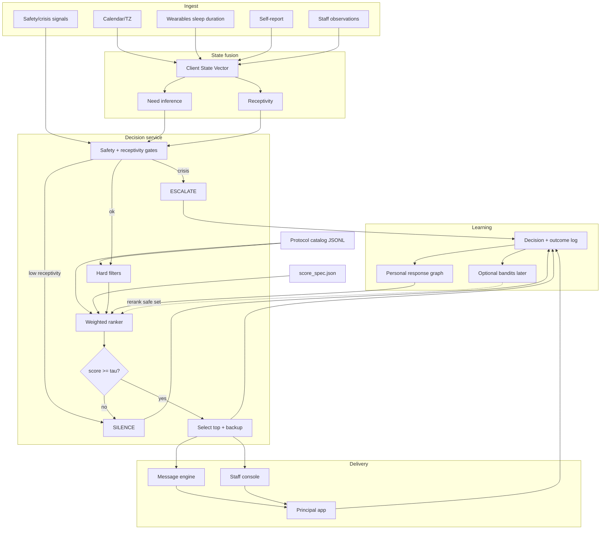

# System architecture

## Pipeline (mermaid)

## Components
| Component | Responsibility |
|-----------|----------------|
| Catalog service | Versioned protocol cards + vault opaque IDs |
| State service | Belief vector, freshness, source_class |
| Decision service | Gates, filters, rank, silence |
| Message service | Templates; optional LLM wording |
| Staff console | Propose/accept for UHNW Phase-1 |
| Outcome store | Postgres decision traces |
| Bandit worker | Optional; never bypasses safety |

## Phase-1 stack suggestion
Postgres + rules engine (or OPA-like policy) + calendar sync + staff web console + mobile/WhatsApp opt-in later. On-device ML later.

## Trust boundary
LLM cannot select protocols unsupervised; cannot emit vault steps; cannot override hard excludes.
