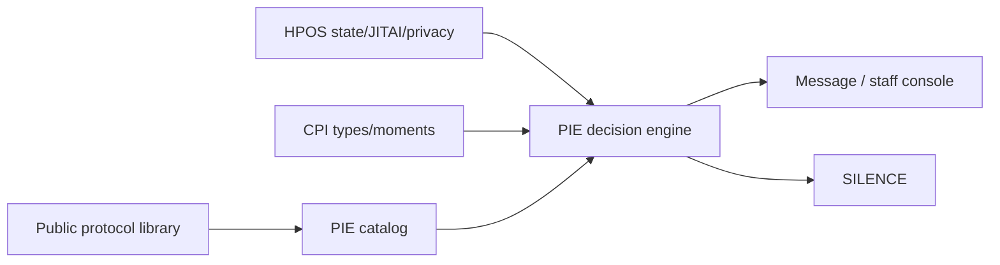

# Protocol Intelligence & Selection Engine (PIE)

**For:** Viswanadh Reddy — PranaForge  
**Root:** `protocol-intelligence-engine/`  
**Compiled:** 2026-09-19 (Asia/Calcutta)

## What this is
A **decision-system research pack**: how to select (or withhold) the right public, evidence-graded protocol for a client in context — hybrid rules + weighted ranking + later optional bandits.

## What this is NOT
- Generic wellness blog advice  
- Invented Daily Forge / vault IP recipes  
- A validated clinical instrument (ranking score is an **engineering heuristic**)  
- Medical diagnosis/treatment  
- NSDR-as-sleep or LoA-as-science  

## How it relates to sibling packs

| Pack | Role vs PIE |
|------|-------------|
| **Protocol library** (`../_protocols.json`, `01_MASTER_DATABASE.md`, category files) | Seed content + evidence grades A–E |
| **HPOS** (`../human-performance-os/`) | Sense → state → JITAI → receptivity → privacy → closed loop |
| **CPI** (`../client-protocol-intelligence/`) | Client-type priors, moments, stacks |
| **PIE (this)** | Machine schema, catalog enrichment, decision/rank, messages, safety, tests, MVP |

## Directory map

| Path | Deliverable |
|------|-------------|
| `00_FOUNDER_ANSWER.md` | Concise A–R answers |
| `01_schema/` | JSON Schema + human field guide |
| `02_protocol_catalog/` | 50 enriched protocols (`catalog.jsonl`) |
| `03_client_state/` | State vector + JSON schema |
| `04_decision_engine/` | Hybrid engine + real-time tree + moments |
| `05_ranking/` | Heuristic score + `score_spec.json` |
| `06_scenarios/` | ≥40 situation→protocol maps |
| `07_sequences/` | Protocol graph + sequences |
| `08_messaging/` | Copy rules + silence policy |
| `09_learning/` | Closed loop + personal graph |
| `10_safety/` | Contraindications + escalation + non-intervene |
| `11_architecture/` | Mermaid pipeline + components |
| `12_mvp/` | V1→V5 roadmap |
| `13_test_cases/` | 110 cases + JSONL |
| `14_landscape/` | JITAI / companies / gaps |
| `15_ip_novelty/` | Novelty vs commodity; hard problems |
| `16_sources/` | Sources |

## Non-negotiable design constraints
1. Hybrid: **deterministic filters + weighted ranking + optional later bandits**  
2. **Silence** is first-class  
3. Distinguish measured / estimated / self-report  
4. No medical treatment claims; CBT-I sleep restriction **clinician-only**  
5. NSDR ≠ sleep replacement; no LoA metaphysics as science  
6. Vault methods: opaque `protocol_id` only  
7. Ranking score ≠ validated clinical instrument — say so explicitly  

## Build first
**Staff console Top-3 protocol picker** — see `00_FOUNDER_ANSWER.md` §R and `12_mvp/MVP_ROADMAP.md` V1.

## Counts
| Asset | n |
|-------|---|
| Catalog protocols | 50 |
| Test cases (MD) | 110 |
| Test cases (JSONL) | 110 |
| Situation maps | ≥40 (+ extras) |
